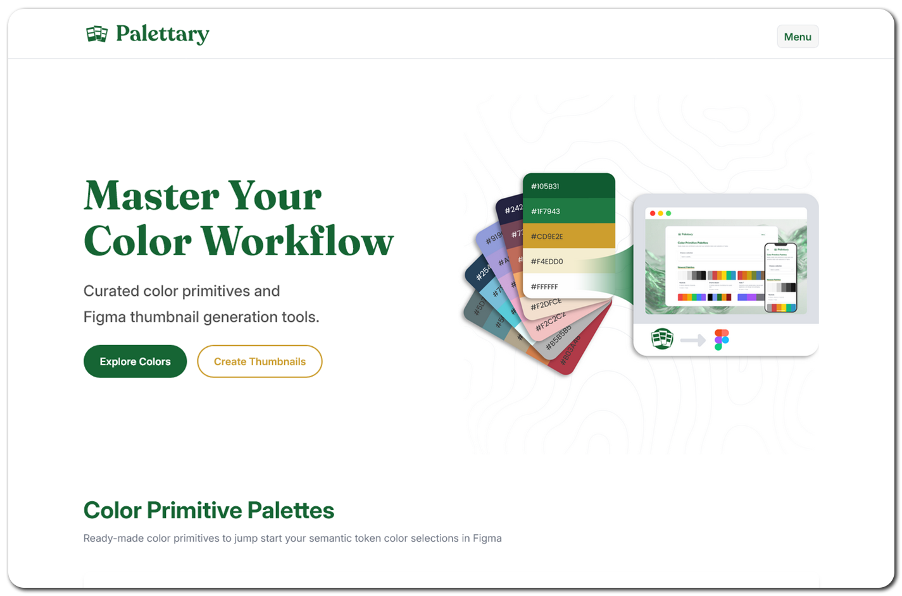
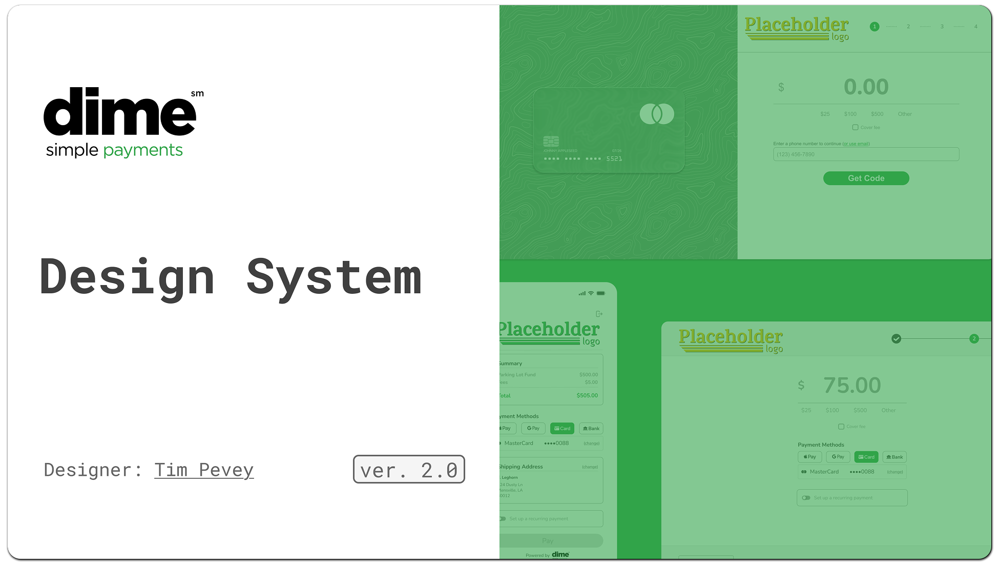
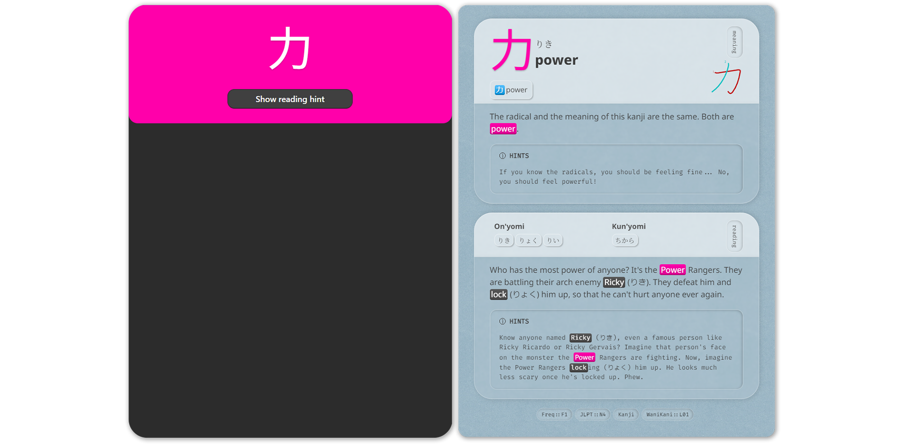
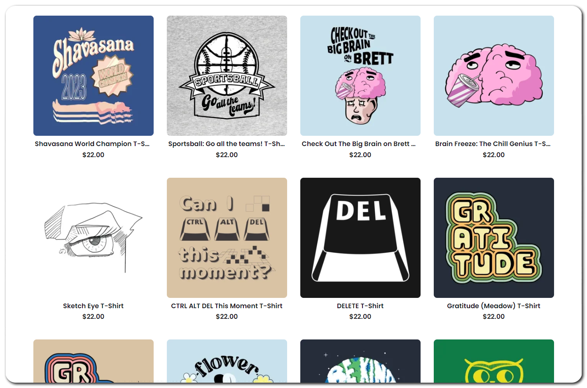
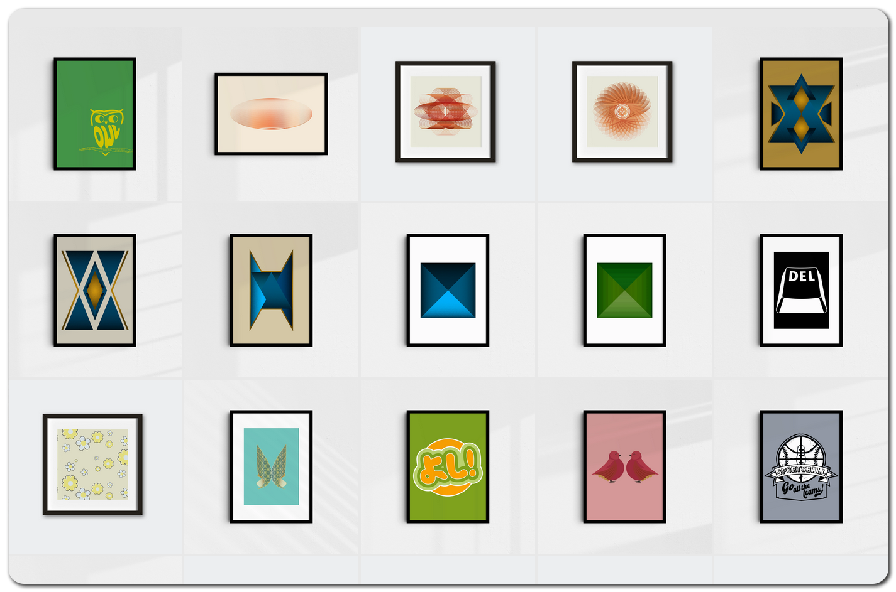

  
  <h1>Tim Pevey</h1>
  
<strong>UI/UX Designer & Design System Architect</strong>

  
  &nbsp;&nbsp;&nbsp;&nbsp;&nbsp;&nbsp;&nbsp;&nbsp;&nbsp;

 

  

    I use my background in graphic design, web development, and literary studies to solve problems and tell stories. I specialize in creating scalable, developer-ready design systems and intuitive interfaces that bridge the gap between creative vision and technical implementation.
  

---

<h3 align="center">Design & Development Stack</h3>

<!-- Tech Stack Badges -->

  <picture>
    
  </picture>
  &nbsp;&nbsp;&nbsp;
  <picture>
    
  </picture>
  &nbsp;&nbsp;&nbsp;
  <picture>
    
  </picture>
  &nbsp;&nbsp;&nbsp;
  <!-- <picture>
    
  </picture>
  &nbsp;&nbsp;&nbsp; -->
  <picture>
    
  </picture>
  &nbsp;&nbsp;&nbsp;
  <picture>
    
  </picture>
  &nbsp;&nbsp;&nbsp;
  <picture>
    
  </picture>

---

<h3 align="center">Featured Projects</h3>

  <h3><a href="https://github.com/datatimp/palettary">Palettary</a></h3>
  <strong>Web apps for Figma</strong>
  
A collection of web apps for Figma including color primitive collections and file thumbnail generator.

  
   
  
  

     

  <h3><a href="https://www.figma.com/design/QaE6JEJ1vNFc1Y8XOrcogl/Dime-Payment-Design-System?m=auto&t=ZEBJ9t8beEsmTjA9-1">Dime Design System</a></h3>
  <strong>Design System Architecture</strong>
  
Comprehensive design system for Dime Payments, featuring scalable component libraries and tokens.

  
   
  

     

  <h3><a href="https://github.com/datatimp/anki-cards">Anki Cards</a></h3>
  <strong>Educational Tools</strong>
  
Custom styling and templates for language learning decks, turning complex DBs into intuitive tools.

 
   
  

---

<h3 align="center">Creative Ventures</h3>

  <h3><a href="https://validopinion.dashery.com/">Valid Opinion</a></h3>
  <strong>Apparel Design</strong>
  
My T-Shirt store featuring original art.

  
   
  <a href="https://validopinion.dashery.com/">Visit Store</a>

     

  <h3><a href="https://www.behance.net/gallery/239903619/Art-Prints">Art Prints</a></h3>
  <strong>Graphic Design</strong>
  
A curated sampling of my graphic design work.

  
   
  <a href="https://www.behance.net/gallery/239903619/Art-Prints">View Gallery</a>

